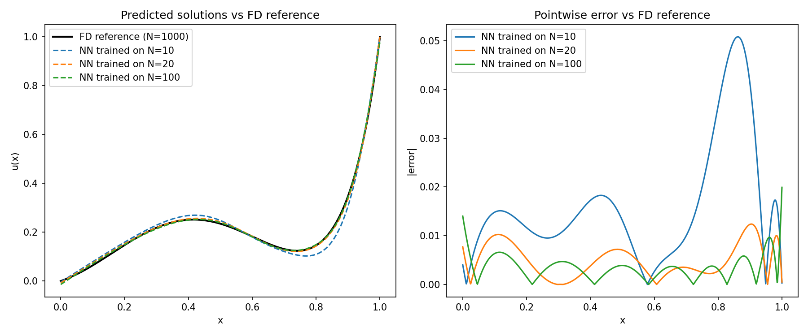
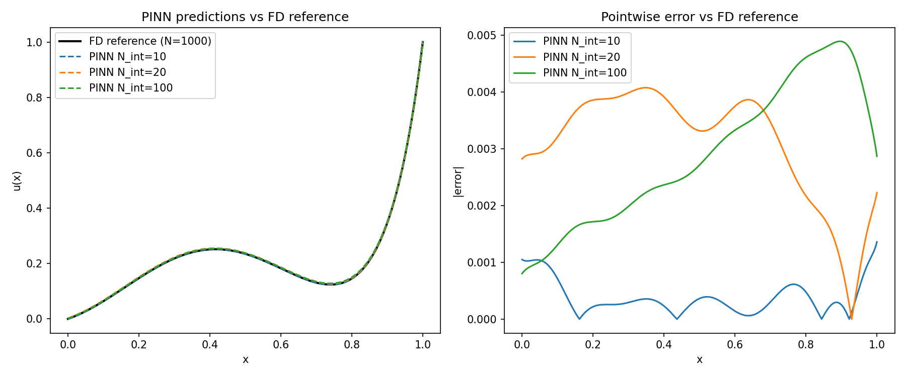
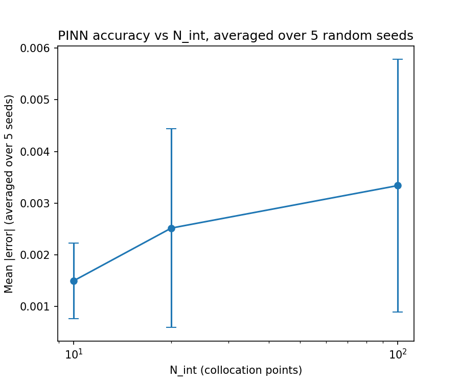

# Results

## Part 3 - Data-Driven Regression Network

Three MLPs (2 hidden layers, tanh activation) trained on labeled `(x, u(x))`
pairs from the FD solver at N = 10, 20, 100. Evaluated against a fine N=1000
FD reference, never used in training.

| Training grid (N) | Mean \|error\| | Max \|error\| |
|---|---|---|
| 10  | 0.01691 | 0.05239 |
| 20  | 0.00605 | 0.02546 |
| 100 | 0.00297 | 0.01541 |

**Result:** error decreases monotonically and substantially as training
resolution increases — a ~5-6x reduction in mean error from N=10 to N=100.
Errors are largest near x=1, where the solution rises steeply and sparse
data (N=10) under-samples this region. Purely data-driven regression is
bottlenecked by training data density, as expected.

## Part 4 - Physics-Informed Neural Network (PINN)

Trained using only the PDE residual and boundary-condition losses — no
labeled `(x, u(x))` data at any point. Collocation points are resampled
randomly every epoch rather than held fixed.

A single seeded run initially suggested collocation count (`N_int`) affects
accuracy, but **the direction of the effect was not reproducible** across
machines/seeds — one run found N_int=10 best, another found N_int=100 best.
This prompted a proper multi-seed check.

### Multi-seed check (5 seeds per N_int)

| N_int | Avg mean \|error\| | Std dev | Avg max \|error\| |
|---|---|---|---|
| 10  | 0.00205 | 0.00122 | 0.00504 |
| 20  | 0.00236 | 0.00199 | 0.00476 |
| 100 | 0.00165 | 0.00060 | 0.00238 |

**Result:** the standard deviation across seeds is comparable to or larger
than the differences between N_int values — there is **no statistically
significant effect of collocation count** on final PINN accuracy in this
setup. This is a real and interesting contrast with Part 3: since
collocation points are resampled every epoch (not fixed like the FD
training grid), N_int does not control "how much information the network
sees" the way N did for the regression network — it only affects the
per-step batch size, with training noise (random initialization, stochastic
optimization) dominating any systematic effect.

*(All PINN runs, regardless of N_int, are still ~5-10x more accurate than
the worst-case data-driven network from Part 3, since the PDE residual
supervises the network at effectively unlimited points during training.)*

### Boundary weight (λ_b) sensitivity

With N_int = 50 fixed:

| λ_b | Final loss_res | Final loss_b | u(0) predicted | u(1) predicted |
|---|---|---|---|---|
| 0.1 | 0.000048 | 0.000020 | -0.0025 | 1.0063 |
| 1.0 | 0.000060 | 0.000419 | 0.0083 | 1.0208 |
| 10.0 | 0.000380 | 0.000112 | -0.0028 | 0.9873 |
| 100.0 | 0.001444 | 0.000002 | 0.0014 | 0.9998 |
| 1000.0 | 1.157278 | 0.000215 | 0.0158 | 1.0183 |

**Result:** loss_res grows steadily with λ_b, then explodes ~1000x at
λ_b=1000 — the network sacrifices the PDE almost entirely to force an exact
boundary match. λ_b=100 gives the best practical balance.

## Part 5 - DeepONet (Operator Learning)

Trained on 1500 source functions `f` sampled from a Gaussian Random Field
(length-scale 0.1, rescaled to [-1,1]), using 21 sensor points, with
κ=0.1, a=1 fixed. Tested on 5 unseen source functions.

| Latent dimension (p) | Train loss | Test mean \|error\| | Test max \|error\| |
|---|---|---|---|
| 3  | 0.000638 | 0.01553 | 0.10932 |
| 5  | 0.000209 | 0.00947 | 0.05237 |
| 10 | 0.000252 | 0.01059 | 0.07776 |
| 20 | 0.000229 | 0.01008 | 0.06669 |
| 50 | 0.000274 | 0.01095 | 0.07866 |

**Result:** p=3 is clearly insufficient — too few learned basis functions to
represent the range of solution shapes. From p=5 onward, test error is
roughly stable (~0.009-0.011 mean), with no meaningful benefit from larger
p. p=5-10 is an adequate latent dimension for this problem.

An interactive browser demo (`deeponet_explorer.html`) exports the trained
network's weights directly into JavaScript, letting anyone test arbitrary
new source functions against a live FD reference — no Python required.

## Overall takeaway

| Method | Needs labeled data? | Generalizes across f? | Key finding |
|---|---|---|---|
| Data-driven regression | Yes, lots | No | Accuracy scales cleanly with data density |
| PINN | No | No | Comparable accuracy with zero labeled data; insensitive to collocation count once seed noise is accounted for |
| DeepONet | Yes (across many f) | **Yes, instantly** | Trades some per-instance accuracy for solving new f without retraining |
